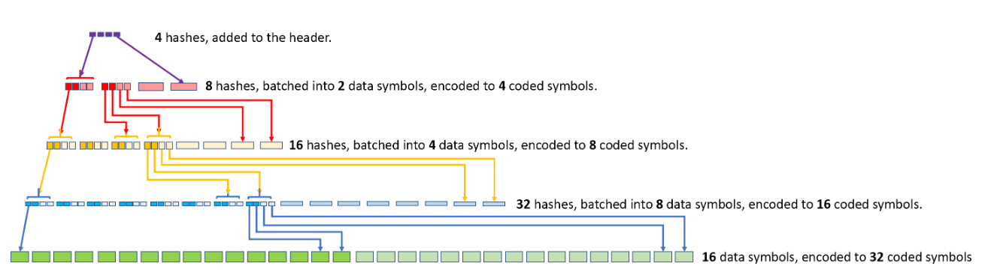

# NCMT
**this is a purely investigational implementation and a WIP. use at your own risk**  
**heavily** influenced by [nmt](https://github.com/lazyledger/nmt) and [rsmt2d](https://github.com/lazyledger/rsmt2d). All image credit goes to the respective authors.  

Namespaced Coded Merkle Trees is a go implementation of a coded merkle tree as described in this [paper](https://arxiv.org/abs/1910.01247) by Mingchao Yu et al, 

with the inclusion of namespaces as described in the [LazyLedger paper](https://arxiv.org/abs/1905.09274) written by Mustafa Al-Bassam. 

## Observations and Comparisons to rsmt2d and nmt

- NCMTs are significantly more restricted in the number of unique namespaces that can be included per block. Both are limited by the RS codec used, but due to rsmt2d square structure, it can include exponentially more.

- Generating NMTs for rsmt2d, along with the data erasure process, are trivial to parallelize. Each layer of the CMT must be completed before moving to the next, which makes building the tree significantly less parallelizable. 

## Implementation Details
Due to inclusion of namespaces, the need to batch erasured nodes in a tree, I figured it would propbably just be faster to implement a cached tree rather than modify some existing library. 